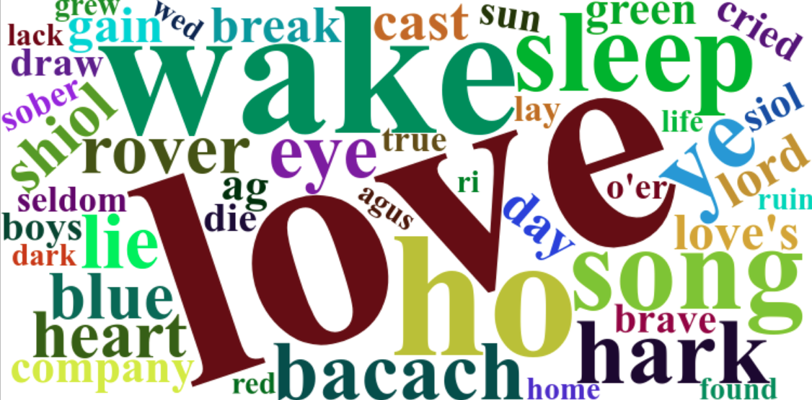

<!-- README.md is generated from README.Rmd. Please edit that file -->

```{r, include = FALSE}
knitr::opts_chunk$set(
  collapse = TRUE,
  comment = "#>",
  fig.path = "man/figures/README-",
  out.width = "100%"
)
```

# lyriclensR

<!-- badges: start -->
<!-- badges: end -->

The goal of lyriclensR is to test how to work with lyrics

## Installation

You can install the development version of lyriclensR with:  

``` r
pak::pak("gorkang/lyriclensR")
```

For the Python dependencies:  

``` r
reticulate::py_install("lyricsgenius", method = "virtualenv")
reticulate::py_install("undetected_chromedriver", method = "virtualenv")
reticulate::py_install("setuptools", method = "virtualenv") # setuptools includes distutils
``` 

## Example

This is a basic example which shows you how to download all the lyrics for specific artists using the Genius API (maximum of 5000 calls for each account per day. For more information https://developer.subscriptiongenius.com/2/intro/):


```r
download_all_artists("Ye Vagabonds")
```

A more complex example where we download and process all the lyrics for the artists of a Spotify list:

```r
library(lyriclensR)

download_process_spotify_list(
  spotify_list_URL = "https://open.spotify.com/playlist/3hdkI3sIYMAPTz2aXNgXt4",
  only_new = FALSE,
  continue_after_error = FALSE,
  end_message = TRUE)

```

Search for a word in the lyrics

```{r search}
# We include a lyrics file with the package
filename = system.file("extdata", package = "lyriclensR") |> list.files(full.names = TRUE)

OUTPUT = lyriclensR::search_words(data = filename, 
                         highlight_words = "love")

# Here we show only 2 results
knitr::kable(OUTPUT$DF_table |> dplyr::slice_sample(n = 2))
```


Create a wordcloud using the lyrics of an artist: 

```r
library(lyriclensR)
create_wordcloud(lyrics = filename)
```

